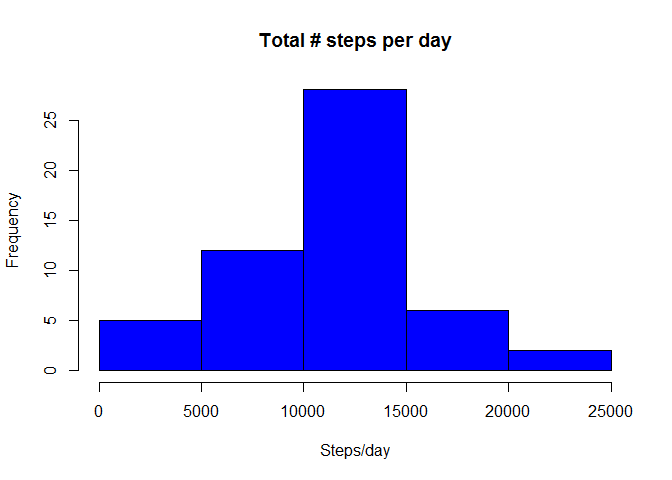
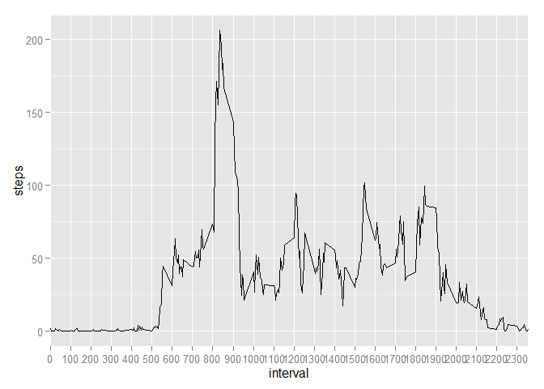
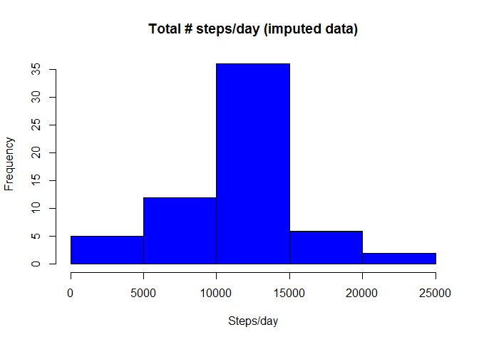
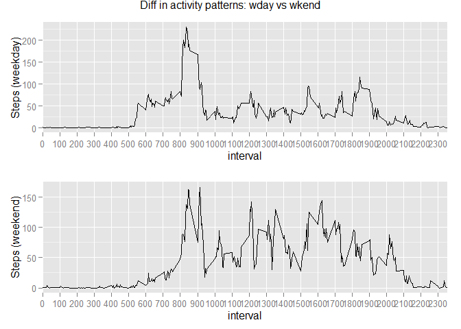

``` {.r}
options(scipen=999)
```

|Title|Reproducible Reasearch - Assignment1|
|-----|------------------------------------|
|Author|Hugo Escobar|
|Date|14 June, 2015|

### Loading and preprocesing the data

``` {.r}
srcData<-read.csv("activity.csv")
```

### mean total number of steps taken per day

Histogram of the total number of steps (frequency) taken each day

``` {.r}
stepsPDay <- aggregate(steps ~ as.Date(date), srcData, sum, na.rm=TRUE)
hist(stepsPDay$steps, col=c(20), main="Total # steps per day", xlab="Steps/day")
```



#### Mean and Median:

-   Mean of total number of steps taken/day: 10766.1886792
-   Median of total num of steps taken/day: 10765

### Average daily activity pattern

Time series plot

``` {.r}
library(ggplot2)
```

    ## Warning: package 'ggplot2' was built under R version 3.1.3

``` {.r}
dailyAvg<-aggregate(steps ~ interval, data=srcData, mean, na.rm=TRUE)
ggplot(data=dailyAvg,aes(x=interval,y=steps))+geom_line()+scale_x_discrete(breaks=seq(0,2400, by=100))
```



Which 5-minute interval, on average across all the days in the dataset, contains the maximum number of steps?

``` {.r}
int5min<-aggregate(steps ~ interval, data=srcData, mean, na.rm=TRUE)
maxNSteps <- int5min[int5min$steps %in% max(int5min$steps), c('interval')] 
gsub("([0-9]{1,2})([0-9]{2})", "\\1:\\2", maxNSteps, perl=TRUE)
```

    ## [1] "8:35"

#### Imputing missing values

Total number of missing values in the dataset (i.e. the total number of rows with NAs)

``` {.r}
sum(is.na(srcData))
```

    ## [1] 2304

Strategy for filling in all of the missing values in the dataset: Here I decided to use the mean of steps per interval to fill up those slots with NA values in the steps column.

For more info on [Imputation](<http://en.wikipedia.org/wiki/Imputation_(statistics)>

New dataset that is equal to the original dataset but with the missing data filled in

``` {.r}
stepPIntrv <- aggregate(steps ~ interval, srcData, mean, na.rm=TRUE)

# Probably not the best way to impute missing values. There are several
# packages that can help with this task but none of them could be installed
# on my system. This solucion has no external dependencies as it has
# been written in standard R

newData <- srcData

for (i in 1:nrow(newData)) {
  if (is.na(newData[i,c('steps')])) {
        interval <- newData[i, c('interval')]
        newData[i, c('steps')] <- stepPIntrv[which(stepPIntrv$interval %in% interval), c('steps')]
    }
}
```

#### Histogram of the total number of steps taken each day;

##### Mean and Median total number of steps taken per day.

``` {.r}
stepsPDay2 <- aggregate(steps ~ as.Date(date), newData, sum, na.rm=TRUE)
hist(stepsPDay2$steps, col=c(20), main="Total # steps/day (imputed data)", xlab="Steps/day")
```



Although the shape of the histogram seems to be the same, the values in the y axis, especially in the 10000-15000 range are greater than the values observed in the first part of the assignment.

### Are there differences in activity patterns between weekdays and weekends?

New factor variable in the dataset with two levels: "weekday" and "weekend" indicating whether a given date is a weekday or weekend day

``` {.r}
newData$weekday <- ifelse(
                weekdays(as.Date(newData[,c('date')])) %in% c('Saturday','Sunday'),
                    'weekend', 'weekday'
                )
newData$weekday <- factor(newData$weekday)
```

Panel plot containing a time series plot (i.e. type = "l") of the 5-minute interval (x-axis) and the average number of steps taken, averaged across all weekday days or weekend days (y-axis)

``` {.r}
# I used two libraries: grid and gridExtra to generate a grid-style output
library(grid)
library(gridExtra)
```

    ## Warning: package 'gridExtra' was built under R version 3.1.3

``` {.r}
stepsWdays <- subset(newData, weekday %in% 'weekday')
stepsWdays <- aggregate(steps ~ interval, data=stepsWdays, FUN=mean)
pweekday <- qplot(interval, steps, data=stepsWdays, geom="line", ylab="Steps (weekday)") +
  scale_x_discrete(breaks=seq(0, 2400, by=100))

stepsWends <- subset(newData, weekday %in% 'weekend')
stepsWends <- aggregate(steps ~ interval, data=stepsWends, FUN=mean)
pweekend <- qplot(interval, steps, data=stepsWends, geom = "line", ylab = "Steps (weekend)") +
  scale_x_discrete(breaks=seq(0, 2400, by=100))

grid.arrange(pweekday, pweekend, nrow = 2, main = "Diff in activity patterns: wday vs wkend")
```


